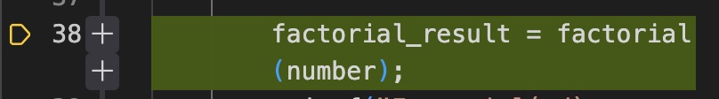

# Sample project for ZXSpectrum Next using Z88dk in VS Code
This repo a slightly modified copy of the [vscode-z88dk-next-sample-project](https://github.com/vmorilla/vscode-z88dk-next-sample-project) repo by [vmorilla](https://github.com/vmorilla).
Main difference is that it does not use a Makefile, so it might be a little easier to setup especially in Windows.

This sample project can run under macos, Linux and Windows.

As a prerequisite you need to have a recent working installation of z88dk.
You can get it [here](https://github.com/z88dk/z88dk), under [releases](https://github.com/z88dk/z88dk/releases) you find some binaries.
Installation instructions are here: [z88dk installation](https://github.com/z88dk/z88dk/wiki/installation).

When everything is installed you should be able to run `zcc` from the commandline, e.g.:
~~~
$ zcc
zcc - Frontend for the z88dk Cross-C Compiler - v22110-51889e5300-20231220

Usage: zcc +[target] {options} {files}
...
~~~

# Files explained
- [src](src): folder with source files. Object (.obj) and list (.lis) files are generated in this folder.

- [build](build): output folder for the resulting .nex and accompanying .map and .lis file.

- [.vscode/launch.json](.vscode/launch.json): configuration of DeZog debugging options

- [.vscode/c_cpp_properties.json](.vscode/c_cpp_properties.json): configuration of the C extension in code for proper syntax checks

- [.vscode/tasks.json](.vscode/tasks.json): configuration of the build task (launching `zcc`) with a problem matcher adapted to the output of Z88dk

- [.vscode/settings](.vscode/settings): settings of the editor, included the automatic launch of the building process

## .gitignore
Normally you would ignore the .lis, .map and .nex files in .gitignore like this:
~~~
src/*.o
src/*.lis
src/*.sym
build/
~~~

However, in this example the files are put to version control so that you can test DeZog even if you do not have the z88dk compiler/assembler installed.

# Two Compilers
The z88dk supports to compilers: the sdcc (-clib=sdcc_ix/y) and the sccz80 (--clib=new).

Only the sdcc is supported for stepping through C-code.
The syntax of the sccz80 in the .lis file cannot be parsed.

# Tutorial

## Building
If you have z88dk installed on your system already you can start with compiling by running the build task.
From the menu start "Terminal->Run Task->zcc build".
You should see something like this in the terminal pane:
~~~
*  Executing task: zcc +zxn -subtype=nex -vn --list -m --c-code-in-asm --lstcwd -clib=sdcc_iy -Cz"--clean" -startup=1 src/*.c src/*.asm -create-app -o build/main.nex
*  Terminal will be reused by tasks, press any key to close it.
~~~

This will re-create all the .lis, map and .nex files.

You can also skip this step if you just want to try out DeZog as all the required .lis, .map and .nex files do come with this repo, as well.
Of course, in this case you cannot change the sources.

## Top of stack
In launch.json you can set the `topOfStack` to the z88dk label `__register_sp` to set the stack for evaluation in DeZog.
~~~json
"topOfStack": "__register_sp",
~~~

## Debugging
1. Set a breakpoint at function `main`:

2. At the debugger choose "zsim" as emulator:

3. Start it (click the green arrow)
4. DeZog will start the program and stop at the breakpoint you have set:

5. Now have a look at the "WATCH" panel. Double-click into it and enter "_max_calculations,2". Do the same for "_factorial_result,2" and "_fibonacci_result,2". You should see the C-variables:

	Notes:
	- The ",2" determines the size of the data, i.e. 2 bytes. This suffix is only necessary if DeZog cannot determine the size by itself.
	- All C-variables have to be preceded by an underscore "_"
	- You can only view global variables. Local variables or function parameters cannot be watched in the same way. But you may find other tricks depending on the compiler to view this data. See later.
6. Now step-over until you reach the call to `factorial(number)`.
Note: If you step over `scanf` you need to switch to the zsim window and input a number otherwise DeZog will not stop as the program waits for user input. Input a low number, e.g. "4".
7. Now **step-into** `factorial(...)`: 
You need to click **step-into** a few times as, under the hood, DeZog executes a few assembler instructions until it reaches the `call`. Opposed to the step-over the **step-into** always executes only one assembler instruction.
8. After a few step-into you have reached the `factorial`function:

9. Step-over
10. Enter "ix+4,2" in the "WATCH" pane. What do you see here? It is the parameter `fact_n` passed to the `factorial` function. For you the parameter value might be different, depending on the number of your input.

11. Now you can try to do a few more step-over, or directly click on the **step-out**
12. DeZog switches back to the caller. If you look at the "WATCH" pane you see that the "_factorial_result" has not been assigned yet.

13. Step-over. Now the variable has been assigned. (Note: depending on your input you might see a different value):

## Wrap Up
This brief tutorial aims to demonstrate how to use DeZog with C code. Keep in mind that DeZog is primarily an assembly code debugger, and its C code debugging features are supplementary.
You may encounter some limitations while debugging C code, but it can still be an enjoyable and educational experience.

# Emulators
The `launch.json` comes with 2 pre-configured emulator settings.
a) The "zsim" internal simulator: You can use it if you only need to emulate the ZX81 or ZX Spectrum. Or only a limited feature set of the ZX Next. The advantage is that it is integrated in DeZog and you can use it right away without additional installations.
b) The "cspect" emulator which you can find [here](https://mdf200.itch.io/cspect). It allows to use the full (I guess) ZX Next features.

For this project you only need "zsim" but you can , of course, try "cspect" as well.

# Caveats
- Although z88dk can create object code for banked memory, the .map and .lis files lack this information. As a consequence, DeZog can not use any banking with z88dk. You will be able to debug such programs, but it may happen that DeZog cannot correctly associate files with program addresses because e.g. the 0xC000 might be used by several banks. This results in wrong display of files when stepping or breakpoints that cannot be set.
- Not all C-code may have corresponding addresses in assembler code. I.e. for those lines you cannot set breakpoints. Try to set the breakpoint at some other line in the vicinity.
